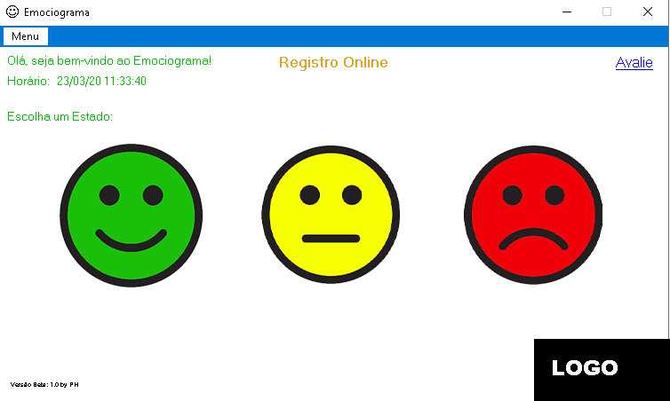
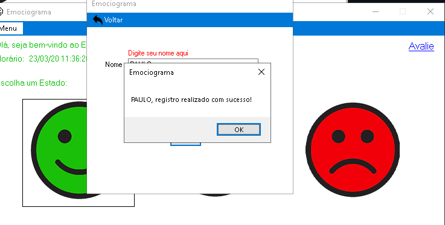

# Medidor Emocional
[](https://github.com/devsuperior/sds1-wmazoni/blob/master/LICENSE) 

# Sobre o projeto

O Emociograma é uma aplicação simples que o intuito de evitar acidente de trabalho, porém pode ser usado para vários nichos. Exemplo, o colaborador deverá indicar o status de humor dele no dia.
Se o colaborador responder com o status amarela ou vermelha, o gestor será notificado e entrará em contato com o funcionário. Evitando executar tarefas de riscos naquele dia.

## Layout Menu



# Tecnologias utilizadas

## Back end
C#

## Implantação em produção
- Banco de dados: SQLlite

# Como executar o projeto

## Back end
Requisitos: .Net FrameWork 4.7


# executar o projeto
Instalar o arquivo emociograma.exe
```

# Autor

Paulo Henrique
